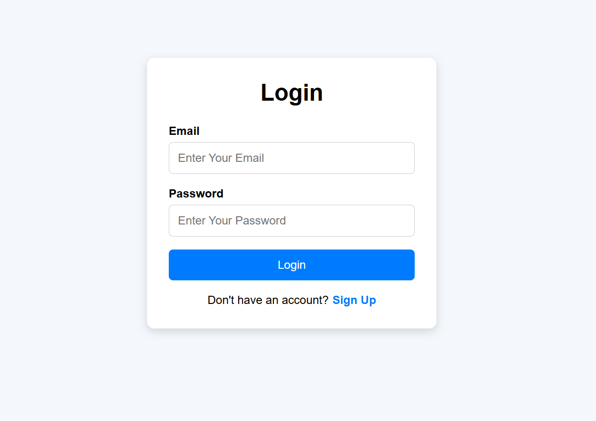
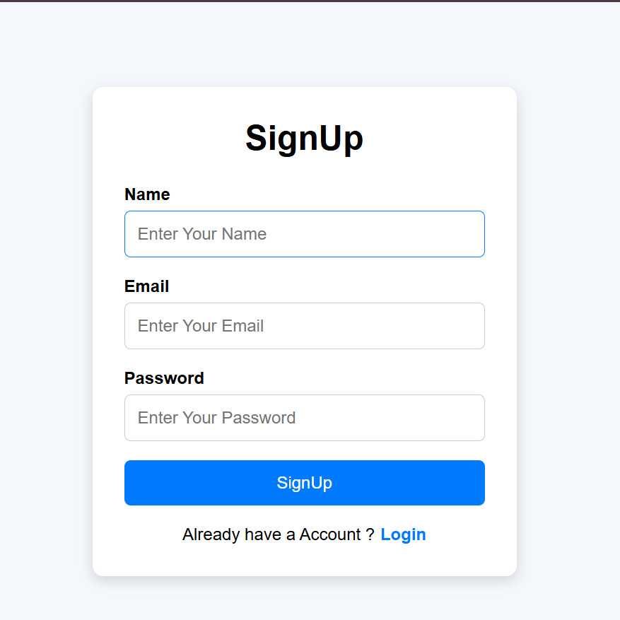
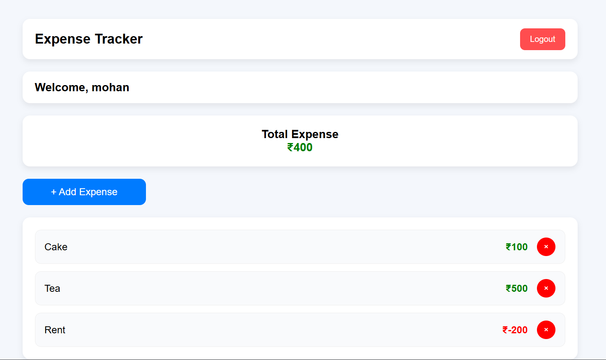

# 💰 Expense Tracker App (Full Stack MERN Project)
A full-stack production-ready Expense Tracker built with authentication, protected routes, and user-specific data handling.

---

## 🚀 Live Demo
Frontend:  https://expense-tracker-app-frontend-xi.vercel.app

Backend:  https://expense-tracker-app-backend-kne1.onrender.com

---

## 🧠 Key Highlights (IMPORTANT)

- 🔐 Authentication using JWT
- 👤 Separate users with isolated data
- 🔒 Protected routes (cannot access expenses without login)
- 💸 Full CRUD for expenses (Add, View, Delete)
- 📊 Real-time total expense calculation
- 🌐 Fully deployed frontend + backend

---

## 🛠️ Tech Stack

### Frontend
- React.js
- React Router DOM
- React Toastify
- CSS

### Backend
- Node.js
- Express.js
- MongoDB
- Mongoose
- JSON Web Token (JWT)
- bcrypt

---

## ✨ Features

### 🔐 Authentication System
- User Signup (Register)
- User Login
- User Logout
- Password hashing using bcrypt
- JWT token generation
- Token stored in localStorage

---

### 👤 User-Specific System
- Each user has their own account
- Expenses are linked to logged-in user
- No user can see another user’s data
- Backend verifies user using JWT before every request

---

### 🔒 Protected Routes
- Expenses routes are protected
- API access only allowed if valid token is provided
- Unauthorized users are redirected to login

---

### 💸 Expense Management (CRUD)
- Add new expense
- Fetch all expenses of logged-in user
- Delete specific expense
- Auto calculation of total expense

---

## 📡 API Endpoints

### Auth Routes
- POST `auth/signup` → Register new user  
- POST `auth/login` → Login user  

---

### Expense Routes (Protected)
> 🔐 Requires JWT token in headers

- GET `/expenses` → Get all expenses of logged-in user  
- POST `/expenses` → Add a new expense  
- DELETE `/expenses/:id` → Delete an expense  

---

## 🔄 System Flow (How It Works)

1. User signs up / logs in
2. Backend validates credentials
3. JWT token is generated
4. Token is stored in frontend (localStorage)
5. Every API request sends token in headers
6. Backend verifies token before allowing access
7. Expenses are fetched only for that specific user

---

## 📸 Screenshots

### 🔐 Login Page

### 🏠 Signup Page

### 💸 Expense Table

